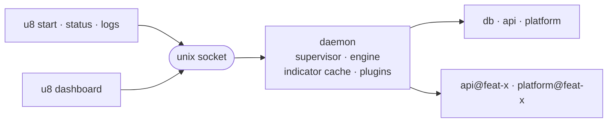

<h1 align="center">u8cli</h1>

<div align="center">

**Run a multi-repo microservice stack from one config —<br>and a separate copy of it for every branch or coding agent.**

[](CHANGELOG.md)
[](#install)
[](#install)
[](tsconfig.json)
[](LICENSE)

[Quickstart](#quickstart) · [Instances](#instances) · [Dashboard](#the-dashboard) · [Commands](#commands) · [Config reference](docs/CONFIG.md) · [Plugins](docs/PLUGINS.md)


</div>

u8cli (`u8`) is a workspace-scoped orchestrator for long-running microservice apps that live in
separate repos anywhere on disk: one `u8.jsonc` describes the stack, and `u8` brings it up in
dependency order with health gating. A per-workspace daemon owns the processes, so services keep
running after you close the terminal, and a live dashboard renders their state from the daemon's
indicator cache.

## Why u8

- **One file for a multi-repo stack.** The checkouts can live anywhere on disk; `u8.jsonc` names
  them, their apps, ports, environment and scripts, and ships a JSON schema for editor completion.
- **Start in dependency order, gated on health.** `dependsOn` holds an app back until what it needs
  passes its HTTP or shell health check — and a script that dies on spawn is reported failed, not ok.
- **A daemon owns the processes.** It starts itself on first use, keeps services up after the
  terminal closes, and exits by itself once nothing is running and nobody is connected.
- **Instances: the same stack, several times at once.** Each has its own git worktrees, ports and
  processes — one per branch, or one per coding agent — and a command typed in a worktree acts on
  that copy only.
- **A dashboard and a scriptable CLI over the same state.** Everything the TUI does is also a
  headless command, and `u8 status --json` gives scripts the same data.
- **Config hot-reload that never touches a running process.** Edits apply in place; a service whose
  script, cwd or env changed is marked `stale` until its next restart.
- **Plugins.** Indicators, commands, hooks and readiness signals from an npm package or a local
  file. `git` and `health` are built in.

## Install

Requires **Node.js ≥ 22** on **macOS or Linux**. Windows is not supported in v1 (WSL works).

```sh
npm install -g u8cli      # or: pnpm add -g u8cli
u8 --version
```

> [!NOTE]
> `0.1.0-rc.1` is not on npm yet. Until it is, build it from source:
>
> ```sh
> git clone https://github.com/nikrabaev/u8cli.git
> cd u8cli
> pnpm install
> pnpm build
> npm link                  # puts `u8` on your PATH
> ```

## Quickstart

```console
$ cd ~/Work/my-stack
$ u8 init
created u8.jsonc
edit the repos you want u8 to manage, then: u8 status
```

A workspace config is a list of repos and what to run in each:

```jsonc
{
  "$schema": "https://unpkg.com/u8cli/schema.json",
  "name": "my-stack",
  "repos": {
    // A dependency that is not HTTP: probed with a shell command.
    "db": {
      "path": "~/Work/infra",
      "scripts": { "start": "docker compose up postgres" },
      "health": { "cmd": "pg_isready -h localhost" }
    },
    "api": {
      "path": "~/Work/api",
      // Declared once, referenced everywhere else — and different in every instance.
      "ports": { "http": 3000 },
      "env": { "PORT": "${ports.http}" },
      "scripts": { "start": "pnpm dev" },
      "health": { "http": "http://localhost:${ports.http}/healthz" },
      // api is not started until db passes its health check.
      "dependsOn": ["db"]
    }
  }
}
```

Point the repo entries at your checkouts and give each one a `start` script, then bring the stack
up. (The transcripts below are [`examples/demo`](examples/demo) in this repo: two single-service
repos, a monorepo with two apps, healthchecks and `dependsOn` throughout.)

```console
$ u8 start
✓ db                ok 506ms
✓ platform.shell    ok 516ms
✓ api               ok 504ms
✓ platform.auth-mfe ok 506ms

TARGET             RESULT  TIME   DETAIL
db                 ✓ ok    506ms
api                ✓ ok    504ms
platform.shell     ✓ ok    516ms
platform.auth-mfe  ✓ ok    506ms
app:start: 4 ok in 8.6s (run mssv98od-977d9716)
```

Each target reports about half a second because a service is only called started once it has
survived a 500 ms grace — a script that dies on spawn is reported failed rather than ok, so the
exit code is worth something in CI. The 8.6 s wall time on top of that is `dependsOn` gating: `api`
waited for `db` to pass its healthcheck, and `platform.auth-mfe` waited for `api` (see
[CONFIG.md](docs/CONFIG.md#dependson-and-readiness)).

```console
$ u8 status
u8-demo · profile full · 4/4 running
  running  db               healthy   14s   -
  running  api              healthy   12s   3000
platform             platform main 9
  running  shell            healthy   15s   3100
  running  auth-mfe         healthy   7s    3101
```

`db` and `api` are single-service repos, so each renders as one merged row; `platform` is a monorepo,
so it gets a header row plus one row per app. Every column is a template token: status, name,
`{health@status}`, `{app@uptime}` and a config-defined `{port}` on the child rows, and
`{git@branch}` plus `{git@dirty}` on the header — the `9` is nine changed files in that checkout.
In a terminal the status column is a coloured `●`; piped (as above) it falls back to the word,
because a colourless dot means nothing in a log file.

`u8 status --json` prints the same data in a stable, script-readable shape.

That demo workspace — four services across three repos, healthchecks, `dependsOn`, a config-defined
indicator and a task command with hooks — is `cd examples/demo && u8 start` away, and its
[`u8.jsonc`](examples/demo/u8.jsonc) is annotated.

## Concepts

| Concept | What it is |
| --- | --- |
| **Workspace** | A directory holding `u8.jsonc`, found by walking up from the cwd. Everything `u8` does is scoped to one. |
| **Repo** | A source checkout, located anywhere (`path` is absolute, `~`-relative, or relative to the workspace). Groups its apps and carries repo-scoped indicators such as `git@branch`. Not runnable itself. |
| **App** | The runnable unit: one process, one log, one status. A repo declared without `apps` gets one *implicit* app whose id is the repo name. |
| **Profile** | A named selection of targets. The active profile is per-machine state, not config — switching it never touches `u8.jsonc`. |
| **Instance** | A parallel copy of part of the workspace: its own checkout (a git worktree), its own ports, its own processes. What `u8.jsonc` describes is the `base` instance; others run beside it. See [Instances](#instances). |
| **Command** | A named unit of work run against targets. `kind: "task"` runs to completion; `kind: "service"` is supervised. Built-ins: `app:start`, `app:stop`, `app:restart`. |
| **Indicator** | A named value rendered in row templates. Core and plugin ones are written `{ns@name}` — `app@status`, `repo@name`, `health@status`, `git@branch` — and the ones you declare in config by bare name: `{version}`. |
| **Plugin** | An npm package or local file loaded into the daemon, contributing indicators, commands, hooks and a readiness signal. `git` and `health` are built in. |

A **target** is addressed as `repo` (every app of that repo) or `repo.app` (exactly one). Outside
base it carries its instance: `api@feat-x`.

## Instances

One `u8.jsonc`, several copies of the stack running at once — one per branch you are working on, or
one per tool working for you. Each instance has its own git worktrees, its own ports and its own
processes; one daemon runs them all, so `u8` (the dashboard) shows every instance in one list.

```bash
u8 instance create feat-x api platform    # worktrees + ports + init steps
u8 -i feat-x up                           # start it and wait until it answers
u8 -i feat-x instance add db              # later: it gets its own db too
u8 -i feat-x instance remove platform     # …and goes back to using base's platform
u8 instance destroy feat-x                # stop, tear down, remove the worktrees
```

Three things make this work without editing the config per copy:

- **Ports are declared, not typed.** `"ports": { "http": 3000 }` gives base port 3000 and every other
  instance one of its own; `"PORT": "${ports.http}"` and `"API_URL":
  "http://localhost:${api.ports.http}"` then resolve per instance. An app that depends on another
  app's port gets the right one automatically.
- **An instance can be partial.** Create one for the frontend alone and it talks to base's api and
  database — references and `dependsOn` fall back to base for whatever the instance has no copy of.
- **Commands are scoped by directory.** Inside an instance's worktree, plain `u8 status`,
  `u8 restart api` and `u8 logs api` mean *that* instance. They never fall back to base: a name the
  instance has no copy of is an error that says to write `api@base`.

An instance can grow and shrink after it is created. `u8 instance add db` gives it its own db — a
worktree if it has no checkout of that repo, ports, and that app's init steps only — and
`u8 instance remove db` stops it, runs its teardown and frees its ports. Either one rewires the
instance's other apps (to the new copy, or back to base's); the ones already running go `stale` and
the command names them and the restart that picks the change up. `remove` leaves the checkout in
place, uncommitted work and all: `--prune` gives it up, and removes a worktree u8 created only when
it is clean.

`docs/CONFIG.md` has the details: [ports](docs/CONFIG.md#ports), [references](docs/CONFIG.md#references),
and [instances](docs/CONFIG.md#instances) with their `init` / `teardown` steps.

### Working from a worktree (and for AI agents)

Anything that works in a git worktree — you, or a coding agent that cannot watch a dashboard — needs
one command:

```bash
u8 up
```

Typed in a worktree u8 has not seen, it turns that worktree into an instance (named after the
directory, using the worktree as it is), runs the init steps, starts the apps, **waits until they
are ready**, and prints where they are. Typed again, it does only what is still missing. On failure
it exits non-zero with the end of the failing log.

From then on, in that directory:

| Need | Command |
| --- | --- |
| Where is my copy? | `u8 ports` (or `--json`), `u8 status --json` → `repos[].apps[].urls` |
| Run tests / a script against it | `u8 exec api -- pnpm test` — runs with the instance's `PORT`, `API_URL`, … |
| Restart after a change | `u8 restart api --wait` |
| I need my own copy of another app too | `u8 instance add db`, then `u8 up` |
| Why did it fail? | `u8 logs api -n 100` |
| Done | `u8 stop` (or `u8 instance destroy` to free the ports too) |

The guard rails are the point. From inside an instance nothing reaches base unless it is spelled
`name@base`; `u8 daemon stop` is refused, because it would stop everybody's services; and a worktree
that has no instance yet refuses `start` / `stop` / `run` rather than quietly acting on base. u8 never
deletes a worktree it did not create, and once an adopted worktree disappears the daemon stops that
instance and frees its ports by itself.

A block like this in a repo's `CLAUDE.md` / `AGENTS.md` is all an agent needs:

```markdown
## Running the app
This repo is part of a u8 workspace. From this checkout:
- `u8 up` — start this checkout's own copy of the stack and wait until it is ready. Run it first.
- `u8 ports` — the addresses of this copy. Never assume a port from the docs or the code.
- `u8 exec <app> -- <command>` — run tests or scripts with this copy's environment.
- `u8 restart <app> --wait`, `u8 logs <app> -n 100`, `u8 status`.
Do not run `u8 daemon stop`, and do not start dev servers by hand.
```

Three things u8 cannot do for you:

- An agent running in a **sandbox** needs `u8` allowed to reach the daemon's unix socket under
  `~/.u8` (or to run outside the sandbox).
- An app that **hardcodes a port** instead of reading its environment will not follow its instance —
  and neither will a CORS allow-list or an OAuth redirect URI registered for `localhost:3000`.
- **Every instance runs the base `u8.jsonc`.** A worktree's own copy of the file is not read, so a
  change to the config itself cannot be tried in an instance; edit base's, or point at a copy
  literally with `--config`. A partial instance likewise shares base's database: a task that changes
  the schema should include the database in its instance.

## The dashboard

`u8` with no arguments is the interactive front end: the active profile's repos and apps as
template-rendered rows, refreshed from the daemon's push stream, with a log view and a command
palette.

| Key | Action |
| --- | --- |
| `↑` `↓` or `k` `j` | Move the cursor |
| `PgUp` `PgDn`, `g` / `G` | Page through the list; first / last row |
| `s` / `x` / `r` | Start / stop / restart the selected target |
| `S` / `X` / `R` | Start / stop / restart the whole profile — or, with the cursor in an instance's section, that whole instance |
| `Enter` | Log view for the selection (follow + scrollback); `Esc` or `q` goes back |
| `:` or `p` | Command palette — run any defined command on the selection or the profile |
| `P` | Profile switcher |
| `?` | Toggle the key help |
| `q` | Quit. The daemon and every service keep running |

Inside the log view the same navigation keys scroll the buffer. In the palette, type to filter,
`↑`/`↓` (or `Ctrl-N`/`Ctrl-P`) to move, `Tab` to switch between running on the selection and on the
whole profile, `Enter` to run, `Esc` to close.

Once the workspace has more than the base instance, the list is sectioned: base (its active
profile) first, then each instance under a heading with its own running count. A key that means
"everything" acts on the section the cursor is in, and opening `u8` inside an instance's worktree
lands on that instance.

Everything the dashboard does is also a headless command, and both read the same indicator cache, so
they can never disagree about a target's state.

The dashboard needs a real terminal on both ends. Piped, redirected, in CI, or with `U8_NO_TUI` set,
a bare `u8` prints the status view instead and says so on stderr.

## Commands

Global options are accepted on either side of the subcommand (`u8 --cwd x status` ≡ `u8 status --cwd x`):

| Option | Effect |
| --- | --- |
| `--config <path>` | Use this `u8.jsonc`, skipping upward discovery |
| `--cwd <dir>` | Act as if `u8` was started in `<dir>` |
| `-i, --instance <name>` | Act on this instance. Without it, the instance is the one the current directory is a checkout of, else `base` (`U8_INSTANCE` sits between the two) |
| `--no-color` | Never emit ANSI colour |
| `-V, --version` | Print the u8 version |

| Command | What it does |
| --- | --- |
| `u8` | Open the dashboard |
| `u8 init` | Write a commented `u8.jsonc` skeleton in the current directory (refuses to overwrite) |
| `u8 start [targets...] [--all] [--wait]` | Start services in dependency order. No targets = the active profile (in an instance: every app it runs); `--all` = every target of the instance. `--wait` reports only once each service is *ready* — healthy, when it has a health check — not merely running |
| `u8 stop [targets...] [--all]` | Stop services (reverse dependency order) |
| `u8 restart [targets...] [--all] [--wait]` | Stop then start |
| `u8 up [targets...] [--branch <name>] [--from <ref>]` | Make sure this directory's instance exists, is initialised and is running, and return once it is ready. Prints its addresses. Idempotent |
| `u8 ports [targets...] [--json]` | Print the addresses of this instance's apps |
| `u8 env [target] [--json]` | Print the environment the config gives an app in this instance |
| `u8 exec <target> -- <command...>` | Run a command in an app's directory with that environment; exits with the command's code |
| `u8 instance list [--json]` | List instances; `*` marks the current one |
| `u8 instance create <name> [targets...]` | Create an instance: a worktree per repo, its own ports, then its init steps. `--branch`, `--from`, `--adopt <dir>`, `--path <repo=dir>`, `--set <name=value>` |
| `u8 instance init [name]` | Re-run an instance's init steps |
| `u8 instance add <targets...>` | Add apps to an existing instance: a worktree for any repo it has no checkout of, ports for each app, then the init steps of what was added. `--branch`, `--from`, `--adopt <dir>`, `--path <repo=dir>` |
| `u8 instance remove <targets...> [--force] [--prune] [--discard]` | Take apps out of an instance: stop them, run their teardown, free their ports. Refuses the instance's last app. The checkout of a repo left with no apps is kept unless `--prune`, which removes a worktree u8 created only if it is clean (`--discard` to remove it anyway) |
| `u8 instance destroy [name] [--force]` | Stop it, run its teardown, remove the worktrees u8 created, free its ports |
| `u8 run <command> [targets...] [--serial] [--concurrency <n>]` | Run a command (`test`, `git:pull`, …). `--serial` means one target at a time |
| `u8 status [--json] [--profile <name>]` | Print the profile's rows. `--profile` renders another profile without switching to it |
| `u8 logs <target> [-f] [-n <lines>] [--run <runId>]` | Print, and optionally follow, a target's log (200 lines by default, 5000 max). `--run` reads a task run's log instead of the service log |
| `u8 profile list` | List profiles; `*` marks the active one |
| `u8 profile use <name>` | Switch the active profile (persisted in the state dir) |
| `u8 daemon status` | Report the daemon's version, pid, uptime, clients and idle deadline. Exits non-zero when no daemon is running |
| `u8 daemon stop [--force]` | Stop the daemon and **every instance's** services. Refused without `--force` from inside an instance, or while another instance has services running |
| `u8 daemon logs [-f] [-n <lines>]` | Print the daemon log, 50 lines by default (works while the daemon is down) |

`--all` cannot be combined with explicit targets. Exit codes: `0` success, `1` any failure
(including a run where a target failed), `130` interrupted with Ctrl-C.

Ctrl-C during `u8 start` / `u8 run` **detaches** — it stops the printing, not the run. The daemon owns
the work; pick it back up with `u8 status` or `u8 logs <target> --run <runId>`.

Environment: `U8_STATE_HOME` (state dir root, default `~/.u8`), `U8_LOG_LEVEL=debug` (verbose daemon
and CLI logging), `U8_IDLE_MS` (idle-exit override for a daemon this command spawns; `0` disables it),
`U8_NO_TUI` (bare `u8` prints the status view instead of the dashboard), `NO_COLOR` / `FORCE_COLOR`,
and `SHELL` (the shell every script is run with, falling back to `/bin/sh`).

## The daemon

One daemon per workspace, identified by a hash of the *real* (symlink-resolved) path of `u8.jsonc` —
two checkouts of the same project never share one.



- **Auto-spawn.** Any `u8` command connects to the workspace's unix socket and, if nobody answers,
  spawns the daemon detached with its output already pointed at `daemon.log`. You never start it by
  hand. If it fails to come up because the config is broken, the CLI prints the config errors rather
  than a log tail.
- **It owns everything.** Processes (each in its own process group), log files, the indicator cache
  and every loaded plugin live in the daemon. Closing the terminal, or Ctrl-C'ing `u8 start`, does not
  touch them.
- **Idle exit.** After 10 minutes with no clients connected and no running services it exits by
  itself. Set `limits.daemonIdle` in the config, or `U8_IDLE_MS` in the environment of the command
  that spawns it (which wins, and where `0` turns idle exit off). `u8 daemon status` reports the
  current deadline.
- **Version checks.** A daemon speaking a different IPC protocol version than the client is a hard
  error telling you to `u8 daemon stop`; a same-protocol version difference is only a warning.
- **Stopping.** `u8 daemon stop` shuts services down gracefully (SIGTERM to the process group, SIGKILL
  after `stopTimeout`) before exiting.

The daemon watches `u8.jsonc` and re-applies it in place: templates, indicators, commands, profiles
and the plugin list are hot-applied, an invalid edit keeps the last-good config in service and
surfaces the error, and **running processes are never touched** — a target whose script, cwd or env
changed goes `stale` and picks the change up on its next restart. Editing a plugin's own *file* is
the exception: the module is already imported, so that needs `u8 daemon stop`.

### State directory

Everything runtime lives under `$U8_STATE_HOME/<workspace-id>/` (default `~/.u8/<workspace-id>/`):

```text
~/.u8/df48413e6129/
├── daemon.sock              # unix socket, mode 0600 (falls back to $TMPDIR if the path is too long)
├── daemon.pid
├── daemon.log               # u8 daemon logs
├── state.json               # local state: the active profile (written once you switch)
├── instances.json           # the instances created on this machine: checkouts and ports
├── workspace.json           # which config this dir belongs to, so a checkout can be traced back
└── logs/
    ├── services/<target>.log            # one rotating file per app (10 MB, 3 generations)
    └── tasks/<command>/<runId>/<target>.log   # one per (run, target); oldest runs pruned
```

Nothing here is checked in. Deleting a workspace's directory while its daemon is running is not a
free operation, though: the daemon notices its own state dir has gone, stops its services and exits,
so you lose the running stack along with the logs and the active profile. Stop the daemon first
(`u8 daemon stop`) if you meant to keep the services up.

## Further reading

- [docs/CONFIG.md](docs/CONFIG.md) — the complete `u8.jsonc` reference: every field, default and rule.
- [docs/PLUGINS.md](docs/PLUGINS.md) — writing a plugin, with a complete working example.
- [docs/SPEC.md](docs/SPEC.md) — the design record: architecture, IPC, and what v1 deliberately leaves out.

The package ships `schema.json`, so `"$schema": "https://unpkg.com/u8cli/schema.json"` at the top of
`u8.jsonc` gives your editor completion and validation for the whole config.

## License

[MIT](LICENSE) © Nikita Rabaev
